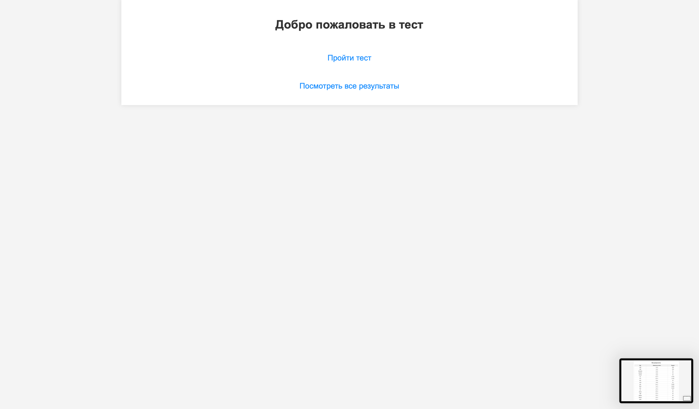
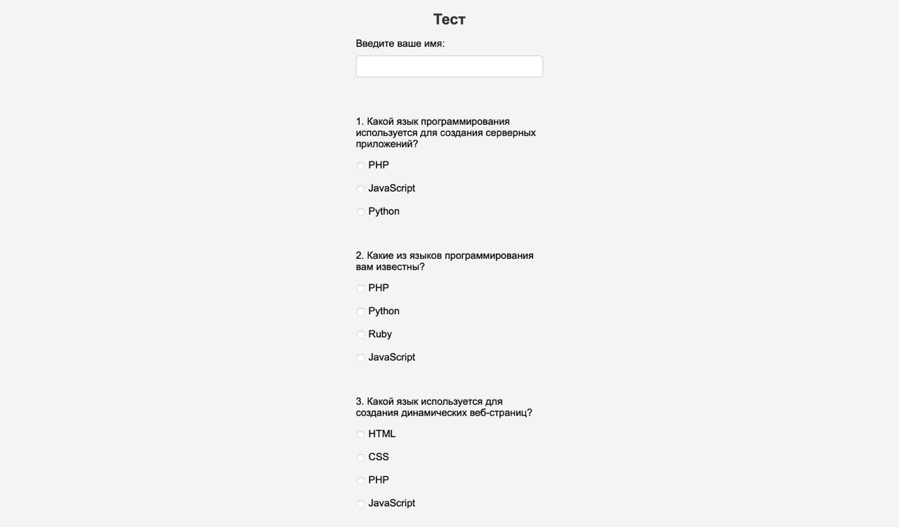
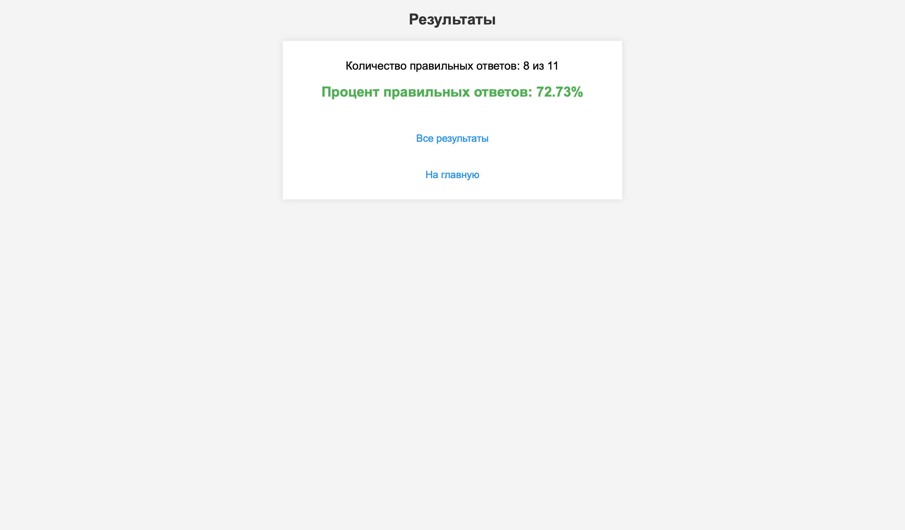
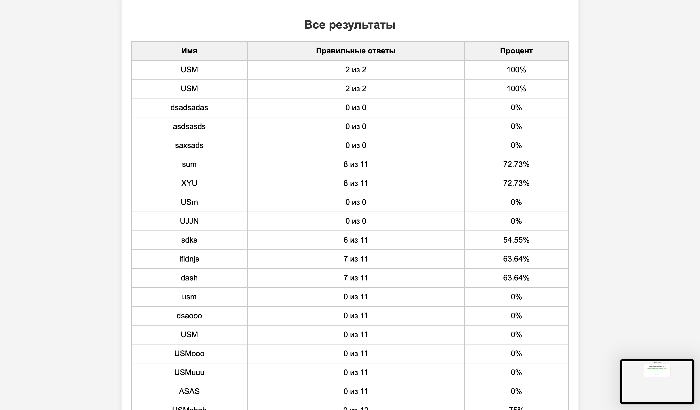

# Веб-приложение для прохождения тестов

## Описание
Приложение позволяет пользователям проходить тесты по программированию. Результаты доступны только администратору.

## Установка
1. Скачайте файлы проекта.
2. Разместите проект на сервере с поддержкой PHP.
3. Создайте файл с вопросами и результатами в формате JSON (например, questions.json и results.json) в папке data/. Пример структуры файлов приведен ниже.
4. Настройте веб-сервер, чтобы он указывал на папку с проектом как на корневую.
4. Откройте браузер и перейдите по адресу вашего проекта (например, http://localhost/test-project).
## Структура проекта
```
/test-app
│── /data
│   │── questions.json  # Файл с вопросами
│   │── results.json    # Файл для хранения результатов
│
│── /css
│   │── styles.css      # Стили
│
│── /includes
│   │── security.php    # Безопасность
│   │── functions.php   # Функции
│
│── /views
│   │── index.php       # Главная
│   │── test.php        # Прохождение теста
│   │── result.php      # Результаты
│   │── dashboard.php   # Админка
│   │── submit.php      # Рассчёт
│
│── README.md           # Документация
```

## Использование
- Открыть `index.php` для начала теста.
- После прохождения теста отобразятся результаты.
- Администратор может войти в `dashboard.php` для просмотра всех результатов.

## Безопасность
- Все данные валидируются на сервере.
- JSON-файлы защищены от прямого доступа.

## Краткое описание функционала

- Прохождение теста: Пользователь может пройти тест, выбрав ответы на вопросы.
- Подсчет результатов: После завершения теста система подсчитывает количество правильных ответов и процент правильных ответов.
- Отображение результатов: Результаты сохраняются в JSON файл и могут быть просмотрены на специальной странице, где отображается имя пользователя, количество правильных ответов и процент правильных ответов.
- Просмотр всех результатов: Все результаты тестов сохраняются и могут быть просмотрены на отдельной странице с возможностью фильтрации по имени.

## Примеры тестов

- Пример структуры вопроса в файле questions.json:

[
  {
    "question": "Какой язык программирования используется для создания серверных приложений?",
    "type": "single",
    "options": ["PHP", "JavaScript", "Python"],
    "correct_options": [0]  // Индекс правильного ответа (PHP)
  },
  {
    "question": "Какие из языков программирования вам известны?",
    "type": "multiple",
    "options": ["PHP", "Python", "Ruby", "JavaScript"],
    "correct_options": [0, 1]  // Несколько правильных ответов
  }
]

- Пример того, как результаты отображаются на странице:

screen





## Структура файлов:
- data/questions.json: Файл с вопросами теста. Пример структуры вопросов приведен выше.
- data/results.json: Файл для хранения результатов тестов, который автоматически обновляется с новыми результатами после прохождения теста.
## Структура данных:
- questions.json:
[
  {
    "question": "Текст вопроса",
    "type": "single" или "multiple",
    "options": ["Ответ 1", "Ответ 2", "Ответ 3", ...],
    "correct_options": [индексы правильных ответов]
  },
  ...
]
- results.json:
[
  {
    "name": "Имя пользователя",
    "score": {
      "correct_answers": 3,
      "total_questions": 5
    }
  },
  ...
]
## Описание полей:
- question: Текст вопроса.
- type: Тип вопроса (single — один правильный ответ, multiple — несколько правильных ответов).
- options: Массив вариантов ответа.
- correct_options: Индексы правильных ответов в массиве options (может быть один или несколько).
## Описание результатов:
- name: Имя пользователя, прошедшего тест.
- score: Объект с результатами:
- correct_answers: Количество правильных ответов.
- total_questions: Общее количество вопросов.